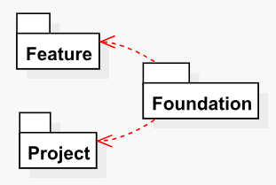
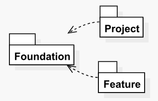

# Layer Diagrams

The _Layer Diagrams_ provide high-level views of the dependencies that the context layer has on other layers and the dependent layers that depend on the context layer. The Layers Diagrams are only generated for solutions for which you have configured the Helix settings so that more granular diagrams can be shown.

It should be noted that the Layer Diagrams are intended to be very simple, so as to provide a readable and quick way to review layer dependencies and find any issues. 

There are two different types of Layer Diagrams, as shown below.

### Layer Dependencies Diagrams

Layer Dependencies Diagrams show the layers that the context layer depends on. These diagrams are very useful as a quick reference and as a fast way to validate all dependencies of a layer, as shown below.

### Layer Dependents Diagrams

Layer Dependents Diagrams show the layers that depend on the context layer. These diagrams are also very useful as a quick reference and for validating dependencies on the context layer, as shown below.

​

