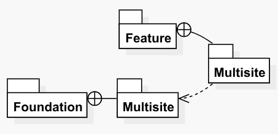
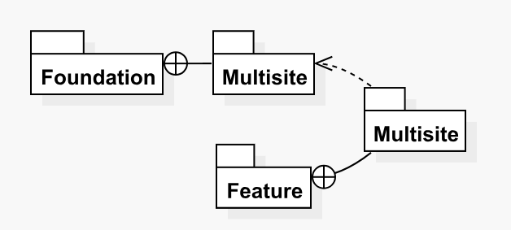

# Module Diagrams

The _Module Diagrams_ provide high-level views of the dependencies that the context module has on other modules and the dependent modules that depend on the context module. The Module Diagrams are only generated for solutions for which you have configured the Helix settings so that more granular diagrams can be shown.

There are two different types of Module Diagrams, as shown below.

### Module Dependencies Diagrams

Module Dependencies Diagrams are high-level diagrams that show the modules \(and their containing layers\) that the context module depends on. These diagrams are very useful as a quick reference and as a fast way to validate all dependencies of a module, as shown below.

### Module Dependents Diagrams

Module Dependents Diagrams are high-level diagrams that show the modules \(and their layers\) that depend on the context module. These diagrams are also very useful as a quick reference and for validating dependencies on the context module, as shown below.

