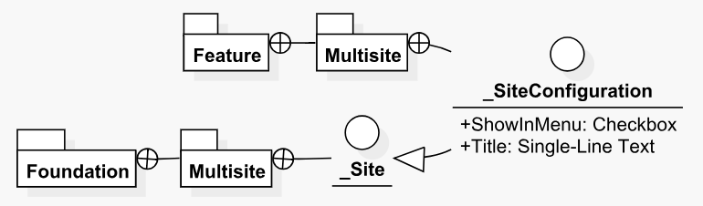

# Module Templates Diagrams

The _Module Templates Diagrams_ provide low-level views of the dependencies that the context module has on other modules and the dependent modules that depend on the context module. The Module Templates Diagrams are only generated for solutions for which you have configured the Helix settings so that more granular diagrams can be shown.

There are two different types of Module Templates Diagrams, as shown below.

### Module Templates Dependencies Diagrams

Module Templates Dependencies Diagrams show the templates that live within the context module as well as their dependencies \(and their containing layers and modules\). These diagrams are useful for finding specific information about particular modules or templates, as well as for helping to track down the source of an invalid dependency within a module. A sample diagram is shown below.

### Module Templates Dependents Diagrams

Module Templates Dependents Diagrams show the templates that live within the context module as well as any templates \(and their containing layers and modules\) that depend on them. These diagrams are useful when planning for changes/assessing other templates that might be affected by a particular change to the context template, as well as a quick way to track down the source of an invalid dependent. A sample diagram is shown below.

