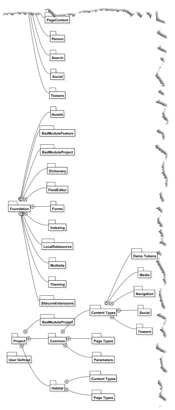

# Template Folders Diagram

The _Template Folders Diagram_ provides a high-level view of the folder structure that the templates in your solution belong to. The Template Folders Diagram is generated for all solutions, regardless of whether or not you have set the Helix settings so that more granular diagrams can be shown.

Unlike the high-level [Templates Diagram](templates-diagram.md), the Template Folders Diagram can be very useful when getting your first look at a solution, as it helps to visual depict the folder structure that is used to store the templates. 

