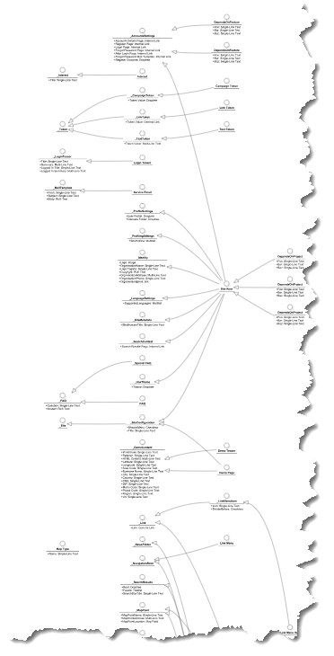

# Templates Diagram

The _Templates Diagram_ provides a high-level view of the inheritance relationships between all of the templates in your solution. The Templates Diagram is generated for all solutions, regardless of whether or not you have set the Helix settings so that more granular diagrams can be shown.

It is worth noting that the Templates Diagram isn't typically the most useful diagram on its own. Most solutions have over 100 templates, and as the number of templates and the amount of template inheritance grows the readability of the diagram diminishes. Regardless, this is still a good diagram for showing those templates most heavily relied upon and for getting a decent overall understanding of how inheritance has been leveraged on a solution.

