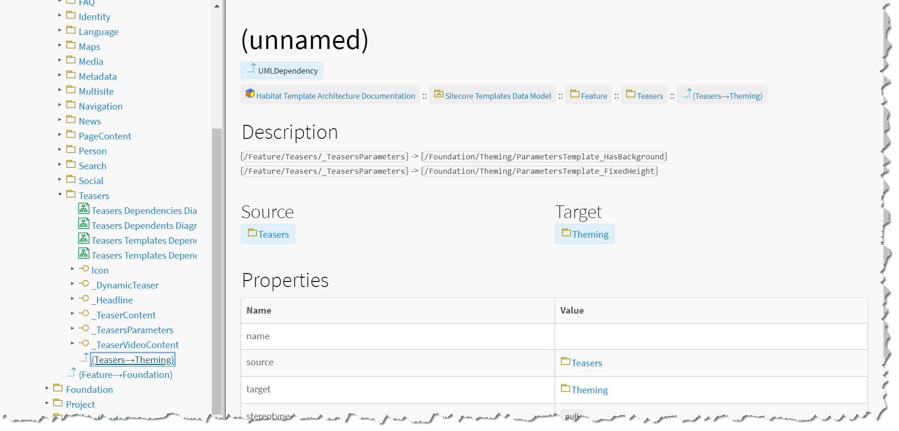
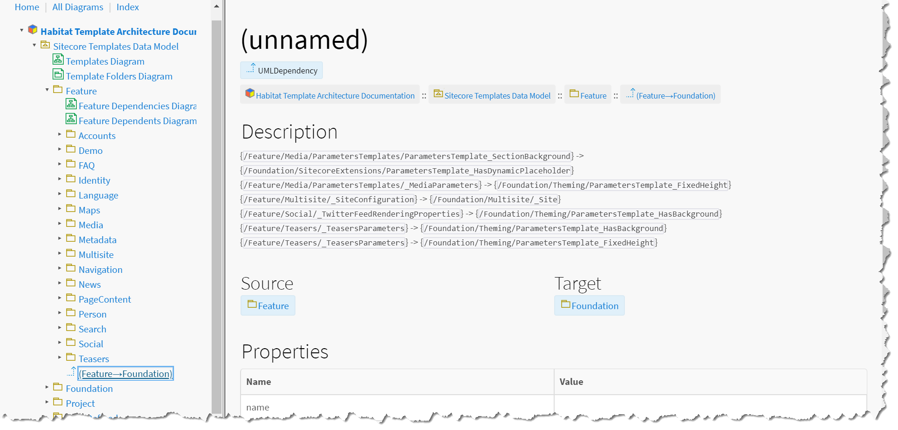

# Dependency Relationship Model

SitecoreDXG is designed to provide robust Sitecore architecture visualization for your Sitecore template architecture, and one of the most important sets of features are the dependency diagramming features. The dependency relationship model generation is part of the Helix Diagramming feature set of SitecoreDXG, and will work for any solution that you configure the Helix settings for in your [_Documentation Configuration_](../../getting-started/installing-sitecoredxg/general-installation/optional-configure-the-documentation-configuration-item-for-your-solution.md) item.

In SitecoreUML, UML Dependency models are used to represent dependencies. It is worth noting that the actual dependency adds no additional information about your architecture to the documentation, but rather is meant to consolidate the inheritance information that is already there.


UML Dependency models and their documentation pages are effectively just scoped summaries of the inheritance information described by the other models.


### Module Dependencies

Module dependencies are added to a source module when one or more of its templates has a dependency on a template in a different, target module. The source module is said to depend on the target module, and any template dependencies from the source module to the target module are added to the module dependency's description for summary display in the output documentation. 


Each source module that contains templates that inherit from one or more templates from a different, target module will have a dependency model that shows that the source module depends on the target module.


### Layer Dependencies

Layer dependencies are added to a source layer when one or more of its modules' templates has a dependency on a template in a different, target layer. The source layer is said to depend on the target layer, and any template dependencies from the source layer to the target layer are added to the layer dependency's description for summary display in the output documentation. 


Each source layer that contains templates that inherit from one or more templates from a different, target layer will have a dependency model that shows that the source layer depends on the target layer.


