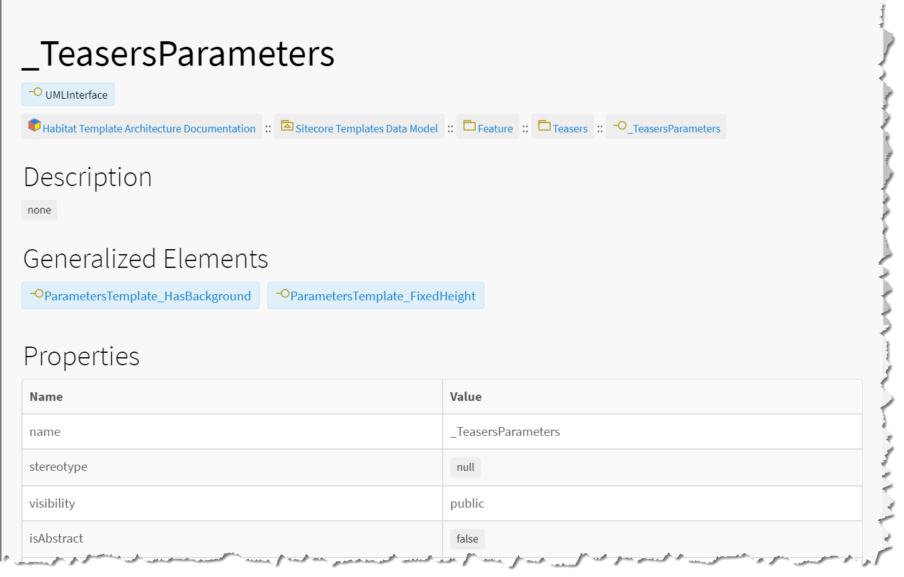
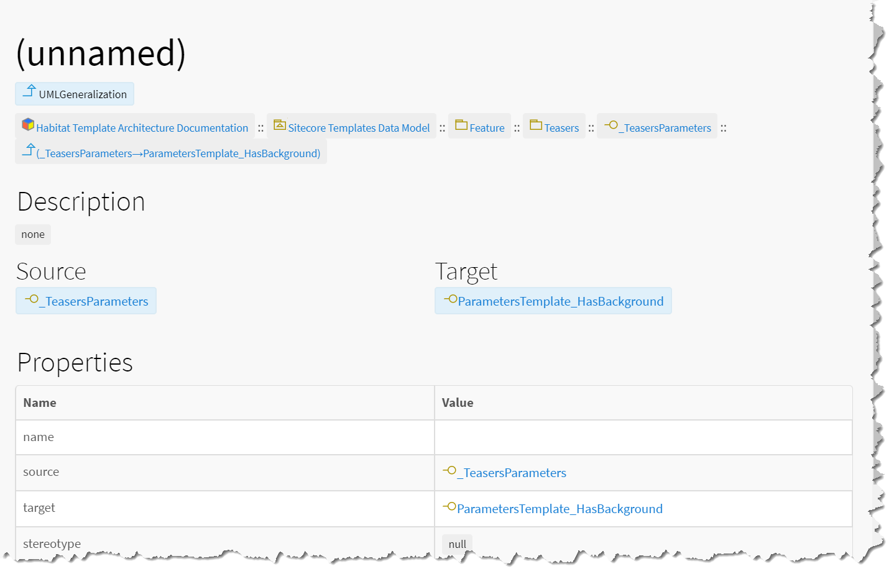

# Inheritance Relationship Model

Inheritance is represented in the documentation generated by SitecoreDXG in several different ways. First and foremost, in SitecoreUML, inheritance is represented as a UML Generalization. 


In UML, a Generalization is a type of relationship that indicates that the source entity generalizes \(or inherits\) the target interface entity. 

In SitecoreUML, UML Interfaces are used to represent Sitecore templates. As such, it stands to reason that template inheritance would be represented by 


### Checking Inheritance on the Template Model

You can quickly see what templates are inherited by a particular template by navigating to the template and looking at it's "Generalized Elements". For example, in the below image of the "\_TeasersParameters" template model, you can see in the "Generalized Elements" section that the "\_TeasersParameters" template inherits the "ParametersTemplate\_HasBackground" and the "ParametersTemplate\_FixedHeight" templates. 

### Inheritance Relationship Models

You can also find the UML Generalization models that represent the inheritance relationships under the source template's model \(i.e. under the model for the template that inherits the dependency template\). 

### Other Ways to View Inheritance

In Sitecore template architecture, dependencies are defined by inheritance, in that a source template only depends on a target template if the source template inherits the target template. As such, whenever you look at a dependency you are looking at one or more \(grouped; e.g. a dependency of one module on another\) inheritance relationships. 

For more information about viewing inheritance through dependencies, see [_Dependency Relationship Model_](dependencies.md).

