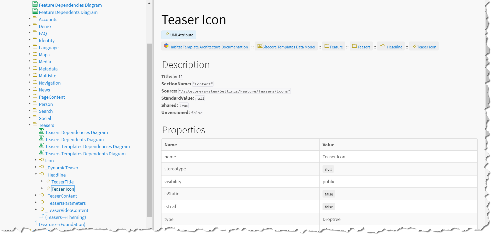

# Template Field Model

A _template field model_ is a property-like representation of a Sitecore template field. In the SitecoreDXG-generated output documentation, template field models are displayed similarly to the documentation page for a C\# class' property on MSDN.

When viewing a template field model, you will be able to see the all of the following information about the represented template field:

* Title
* Section Name
* Source
* Shared
* Unversioned

