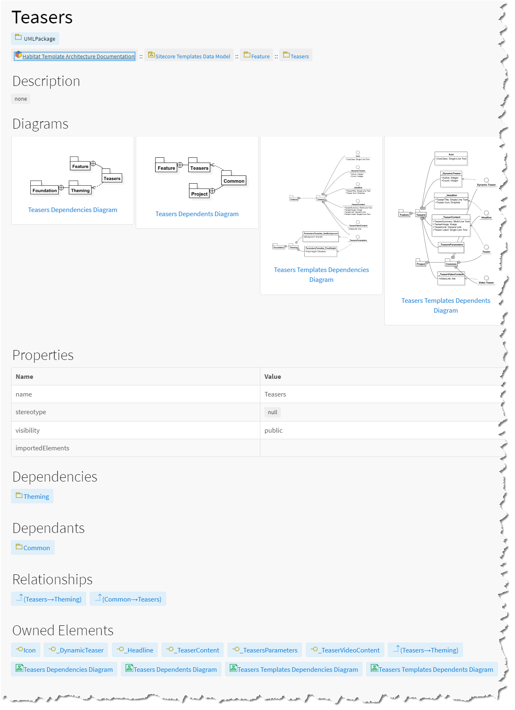

# Template Folder Model

A _template folder model_ is a somewhat namespace-like representation of a Sitecore template folder. In the SitecoreDXG-generated output documentation, template folder models show links to and thumbnails of any diagrams contained within the folder, any dependencies and dependents of the folder \(if a Layer or Module Root folder\), and the folder's ancestry.

In the SitecoreDXG-generated output documentation, template folder models show links to and thumbnails of any diagrams contained within the folder, any dependencies and dependents of the folder \(if a Layer or Module Root folder\), and the folder's ancestry.

