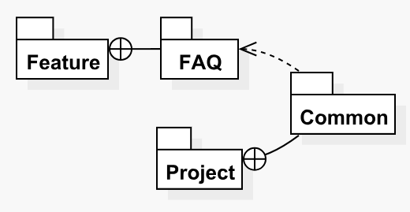

# Dependency Relationship View

In SitecoreUML syntax, a _dependency relationship view_ represents the dependency relationship of one entity on another. While in Sitecore, dependencies are only created through template inheritance, it is important to note that dependency relationships can be used to show resulting dependencies of one module on another, a module on a layer, or a layer on a layer. 

Dependency relationship views are depicted as a dashed arrow connection between two entities, with a non-solid arrowhead connecting to the dependency entity and the arrow's tail connecting to the dependent entity, as shown in the diagram below.

