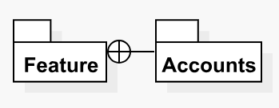

# Parent-Child Relationship View

In SitecoreUML syntax, a _parent-child relationship view_ represents the parent-child relationship, or "containment", of one entity and another.

Parent-child relationship views are depicted as a lollipop-like connection between two entities, with the lollipop's circular head connecting to the parent and the other end connecting to the child, as shown below.

