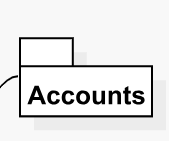

# Template Folder View

A _template folder view_ is a visual representation of a template folder in SitecoreUML syntax, as displayed on the diagrams generated as part of the SitecoreDXG output. 

Template folder views are commonly displayed as a 2-dimensional folder drawing that contains the name of the folder, as shown below.

