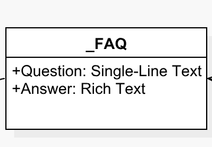

# Template View

A _template view_ is a visual representation of a template and its fields in SitecoreUML syntax, as displayed on the diagrams generated as part of the SitecoreDXG output. 

Template views are commonly displayed in the following two ways, depending on how they are being used.

### Circle Display

In SitecoreUML diagrams, Template Views are often displayed as a circle icon with the template name below or next to it. A fields represented as child line-items, in the syntax `[Name]:[Type]`. 

### Box Display

Whenever a template is shown as a dependency of another template, the Box Display is used for the Template View. In the box display, the template's name is shown in the heading bar of the box and the template fields are shown as child line-items, in the syntax `[Name]:[Type]` .

