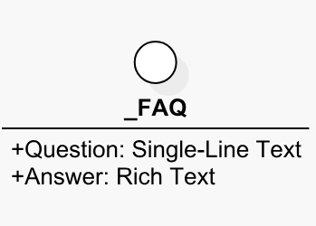

# Template View

A _template view_ is a visual representation of a template and its fields in SitecoreUML syntax, as displayed on the diagrams generated as part of the SitecoreDXG output. 

In SitecoreUML diagrams, Template Views are displayed as a circle icon with the template name below or next to it. A fields represented as child line-items, in the syntax `[Name]:[Type]`. 

