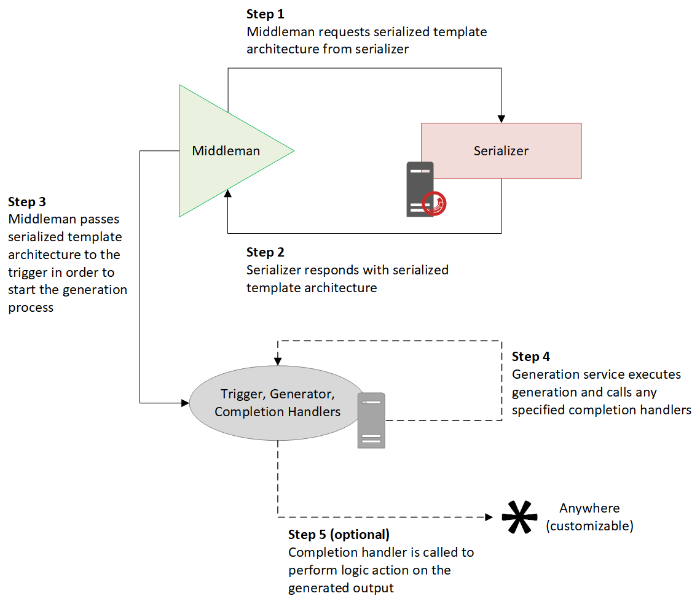

# Roles

A _role_ is a responsibility to satisfy a particular piece of logic and/or task in the communication flow required for SitecoreDXG. A fully-functional SitecoreDXG ecosystem consists of the following roles:

* **Serializer:** responsible for serializing the Sitecore template architecture and making it available to the _middleman_ for retrieval.
* **Middleman:** responsible for retrieving the serialized architecture from the _serializer_ and passing it along to the _trigger_
* **Trigger:** responsible for executing the generation process on the _generator_ with the serialized architecture received from the _middleman_
* **Generator:** responsible for performing the generation process on the serialized architecture when called by the _trigger_
* **Completion Handler:** an optional role responsible for performing post-generation logic on the generated output when called by the _generator_ after it finishes generating

The following diagram shows the general communication workflow between these roles. Note that this workflow may change slightly depending on how you choose to use SitecoreDXG and implement your Middleman and Trigger.

