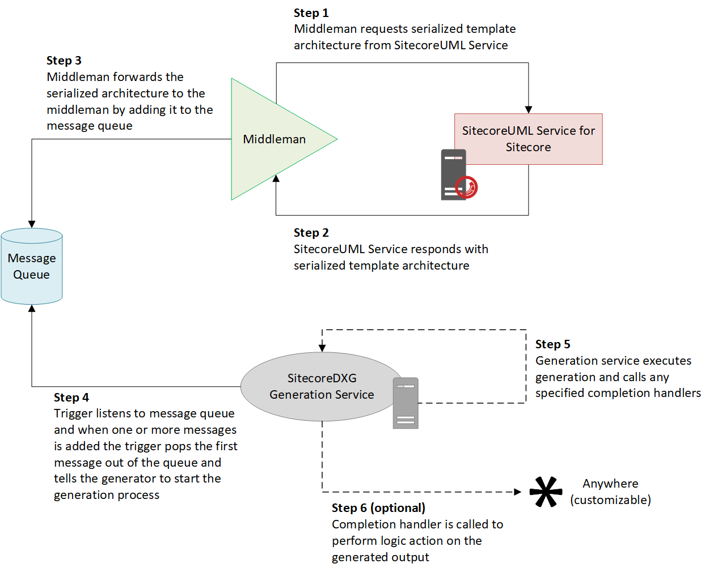

# Understanding the Default RabbitMQ Middleman and Trigger

SitecoreDXG ships with a minimalist middleman and trigger that use RabbitMQ. The trigger is configured as the default for the SitecoreDXG Generation Service and is compatible with the provided middleman.

The included middleman and trigger use RabbitMQ to queue architectures for generation. At a high-level, this works as follows:

1. The middleman retrieves the serialized architecture from the SitecoreUML Service for Sitecore and then adds the response to the desired message queue. By default, the `generation_queue__documentation`and `generation_queue__mdj`

   are supported for generating HTML documentation and a metadata-json file, respectively, but the names of the queues are customizeable via the SitecoreDXG Generation Service's settings.

2. The RabbitMQ trigger, which has a listener for each of the supported queues, detects that a new message was added and calls the appropriate generation logic of the SitecoreDXG Generation Service for the queue on the passed in architecture.

The following diagram shows the full workflow that describes the default SitecoreDXG ecosystem using RabbitMQ for indirect communication between the Middleman and Trigger:

