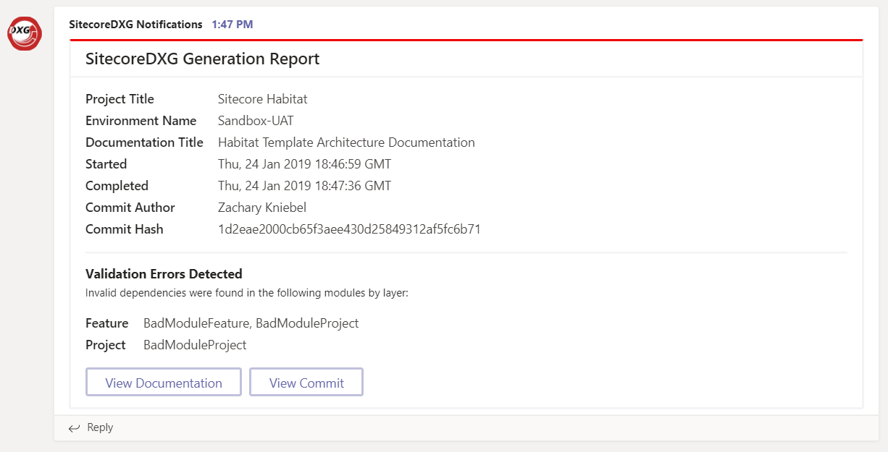

# Integrating with MS Teams via Webhooks

As of version 1.1.0, SitecoreDXG now supports integration with Microsoft Teams for completion notifications via Incoming Webhooks. Like all logic that runs after generation completes, the Microsoft Teams integration is provided by a native [completion handler plugin](../../architecture/plugins/completion-handler-sub-component.md) that posts a message to the Microsoft Teams Incoming Webhook URL with some basic information about the generation and any [Helix validation errors](../../overview/helix-validation.md) that were identified. 

### Sample Notification

Depending on the information that you send in via the `DocumentationConfiguration` property of the `OPTIONS` JSON object, you should see a notification similar to the following sample appear in your Teams channel after generation completes:



### Setup

Fortunately, Microsoft was nice enough to make setting up an Incoming Webhook for Teams super straightforward:

1. Follow the instructions to [set up a custom Incoming Webhook](https://docs.microsoft.com/en-us/microsoftteams/platform/concepts/connectors/connectors-using#setting-up-a-custom-incoming-webhook) 
2. Copy your new Incoming Webhook URL for use in the next step 
3. Create/update the `OPTIONS` JSON object to be passed into your SitecoreDXG middleman to include the MS Teams completion handler and set its `Params.Url` property to your new Incoming Webhook URL, as follows:

```javascript
{
    DocumentationConfiguration: {},
    CompletionHandlers: [{
        ID: "MSTeams_Notifier",
        Params: {
            "Url": "https://outlook.office.com/webhook/XXXXXXXXXXXXXXXXXXXXXXXXX@XXXXXXXXXXXXXXXXXXXXXXXXXXXXX/IncomingWebhook/XXXXXXXXXXXXXXXXXXXXXXXXXXXXXXX/XXXXXXXXXXXXXXXXXXXXXXXXXXXXXXXXXXXXX"
        }
    }]
}
```

Serialized, your `OPTIONS` object should look something like the below:

```javascript
'{\"DocumentationConfiguration\":{},\"CompletionHandlers\":[{\"ID\":\"MSTeams_Notifier\",\"Params\":{\"Url\":\"https://outlook.office.com/webhook/XXXXXXXXXXXXXXXXXXXXXXXXX@XXXXXXXXXXXXXXXXXXXXXXXXXXXXX/IncomingWebhook/XXXXXXXXXXXXXXXXXXXXXXXXXXXXXXX/XXXXXXXXXXXXXXXXXXXXXXXXXXXXXXXXXXXXX\"}}]}'
```

Note that this completion handler supports the default supported `DocumentationConfiguration` properties, and will display their information in the notification, including:

1. `CommitAuthor`
2. `CommitHash`
3. `CommitLink`
4. `DeployLink`
5. `ProjectName`
6. `EnvironmentName`


